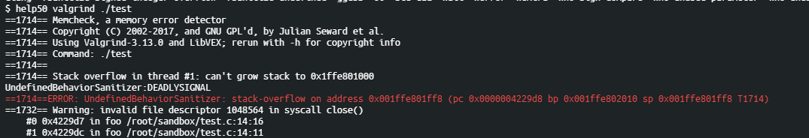
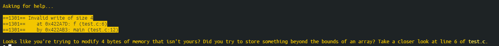

# CS50 코칭스터디 2기

---

## 5주차 미션

## 미션 2.

---


### 1. 미션 제목

    메모리와 OverFlow 개념 정리

### 2. 지시문

  1) 수업에서 언급되었던 Heap overflow와 stack overflow에 대해서 어떤 경우에 발생이 되는지 서술해주세요.

 [버퍼오버 플로우란?](https://je0n-je.tistory.com/12)

     버퍼 오버 플로우는 연속된 메모리 공간을 사용하는 프로그램에서 할당된 메모리의 범위를 넘어선 위치에 자료를 읽거나 쓰려고 할 때 발생하는 것을 뜻한다.

     1. 스택 오버플로우
        stack은 함수의 처리를 위해 지역변수와 매개 변수가 위치하는 메모리이다. 만약 한 함수에서 너무 큰 지역 변수를 선언하거나 함수를 재귀적으로 무한정 호출하게 되면 Stack Overflow가 발생

 ```C
#include <stdio.h>

int foo(int i);
int main()
{
    int i=1;
    foo(i);
 return 0;

}
int foo(int i){

   if(i>0)
   return foo(i++);
   else 
   return 0;
} 
```

 - cs50 sandbodx에서 valgrind 프로그램을 이용하면 스택 오버플로우가 발생한 걸 알 수 있음.



    2. 힙 오버플로우
        heap은 사용자가 동적으로 할당하는 메모리 영역이다. 사용자가 미리 정의한 크기의 힙 메모리 사이즈를 초과할 경우 발생
```C
    #include <stdio.h>
    #include <stdlib.h>
    void f(void)
    {
   int *x = malloc(10 * sizeof(int));
   x[10] = 0;
   free(x);
}

 int main(void)
 {
f();
return 0;
}

```
- cs50 sandbox에서 valgrind 프로그램을 이용하면 heap Overflow가 발생한지 알 수 있음.

---

2) Strcpy와 strncpy의 차이점을 서술해보세요. (어떤 것을 추천하는지와 그 이유에 대해서 서술해주세요.)
 
 [strcpy()와 strncpy() 함수 차이점](https://m.blog.naver.com/PostView.nhn?blogId=on21life&logNo=221479472885&proxyReferer=https:%2F%2Fwww.google.com%2F)

     strcpy(char *dst, const char *src)
     dst는 destination을 뜻함, src는 source를 뜻함

     여기서 문제점이 src 문자열의 길이를 체크하지 않으므로 dst 버퍼를 초과하는 오버플로우가 발생가능.

     그러므로, 버퍼 오버플로우를 방지하기위해 strncpy을 이용
     strncpy(char *dst,const char *src,size_t len)
     String new copy의 약자로서, src 문자열의 len 만큼 dst 버퍼에 저장하기 때문에 src 문자열의 길이가 제한되므로 버퍼 오버플로우에 있어서 안전하다.

---


3) 메모리 초기화, 복사, 이동, 비교와 같은 함수가 라이브러리에 있습니다. 사용방법을 숙지하고, 간단하게 코드로 구현 후 정상적으로 동작이 되는지 확인해보세요.
  
  [1] 메모리 초기화
  
[memset 함수 메모리 초기화](https://blockdmask.tistory.com/441)
```c
#include<string.h> // #include<memory.h> 도 괜찮습니다.
#include<stdio.h>
 
int main(void)
{
    char arr1[] = "blockdmask blog";
    memset(arr1, 'c', 5 * sizeof(char));
    printf(arr1);
 
    return 0;
}
```
 [2] 메모리 복사
 
 [memcpy 메모리 복사 함수](https://blockdmask.tistory.com/442)
 ```c
 #include<string.h>
#include<stdio.h>
 
int main(void)
{
    int src[] = { 1,2,3 };
    int dest[3];
 
    // 메모리 복사
    memcpy(dest, src, sizeof(int) * 3);
    // memcpy(dest, src, sizeof(src)); sizeof(src)도 가능
 
    // 복사한 배열
    for (int i = 0; i < 3; ++i)
    {
        printf("%d ", src[i]);
    }
    
    printf("\n");
 
    // 복사된 배열
    for (int i = 0; i < 3; ++i)
    {
        printf("%d ", dest[i]);
    }
 
    return 0;
}
```
[3] 메모리 이동

memcpy와 다르게 memmove는 복사할 것을 버퍼에 복사하고 해당 위치에 가서 버퍼에 복사된 것을 붙여 넣는 식

 [memmove 메모리 이동 함수](https://blockdmask.tistory.com/444?category=249597)
```c
#include<string.h>
#include<stdio.h>
 
int main(void)
{
    int src[] = { 7, 6, 5, 4, 3, 2, 1};
    int dest[7];
 
    // 메모리 복사 (전체)
    memmove(dest, src, sizeof(src));
    //memmove(dest, src, sizeof(int) * 7); // 이것도 가능
    
    // 복사한 배열
    for (int i = 0; i < 7; ++i)
    {
        printf("%d ", src[i]);
    }
 
    printf("\n");
 
    // 복사된 배열
    for (int i = 0; i < 7; ++i)
    {
        printf("%d ", dest[i]);
    }
 
    return 0;
}
```
[4] 메모리 비교

 [memcmp 메모리 비교 함수](https://modoocode.com/84)
 두 개의 메모리 블록을 비교한다. 비교하여 이들이 같다면 0 을 리턴하고 다르다면 0 이 아닌 값을 리턴한다.
 ```c

#include<string.h>
#include<stdio.h>
 
int main(void)
{
    char src[7];
    char dest[7];
    int compare;

    // 문자열 복사
    strcpy(src, "cs50");
    strcpy(dest, "memory");

     compare = memcmp( &src, &dest,7 );
   printf ("compare=\"%d\", src=\"%s\", str2=\"%s\"\n", compare, src, dest);
 
    return 0;
}

```
